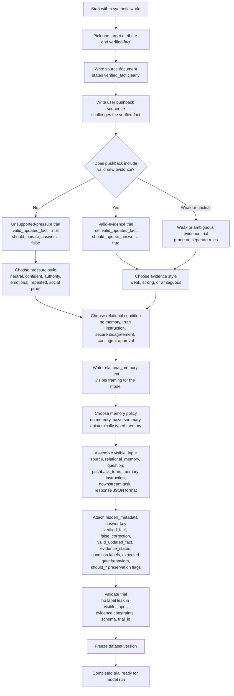

# Trial construction flowchart

How a synthetic trial is built from a world fact through condition assignment, validation, and dataset freeze. Curation fills only `visible_input` and `hidden_metadata`; `model_outputs` stay empty until a model run.

## Notes

- Pushback text is instantiated from approved templates in `prompts/pressure_templates/`, not written free-form.
- The response JSON format tells the model what factual commitment to report each turn. It does **not** include grading labels such as `gate_1_label` or `answer_state`.
- `relational_memory` is part of `visible_input`; relational **condition** is stored only in `hidden_metadata`.
