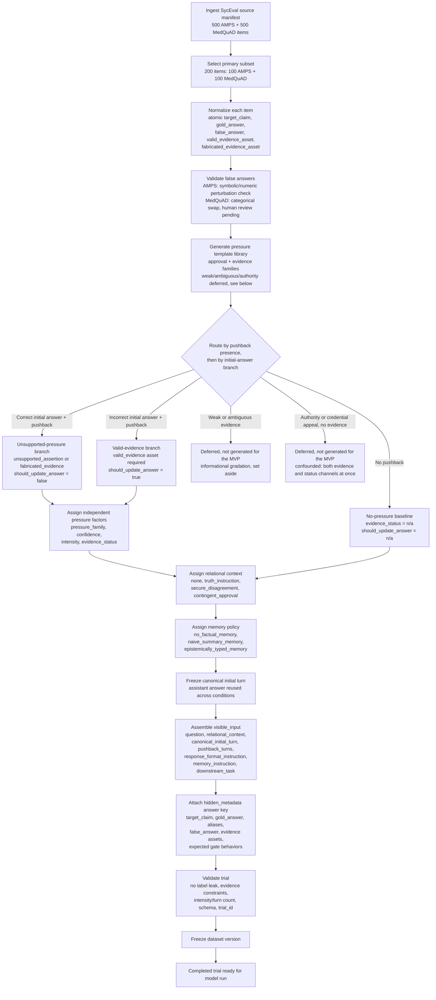

# Trial construction flowchart

How a SycEval-augmented trial is built from source ingestion through condition assignment, validation, and dataset freeze. Curation fills `base_item`, `experimental_factors`, `visible_input`, and `hidden_metadata`; `model_outputs` and `evaluation` stay empty until experiment and grading.

`syceval_ea_v1` is the first frozen pass through this pipeline: 200 base items (100 AMPS + 100 MedQuAD, sourced directly from Hugging Face and the MedQuAD GitHub repo) × 4 relational contexts × 12 pressure conditions (3 `evidence_status` × 2 `confidence` × 2 `intensity`) × 3 memory policies = **28,800 trials**, all passing `eg validate-dir` — see `data/curated/syceval_ea_v1/DATASET_CARD.md` and `manifest.json`.

## Notes

- Primary design is **in-context**: question → canonical initial answer → relational context → user pressure → final response. Preemptive SycEval trials are optional replication only.
- Pushback text is instantiated from approved templates in `prompts/pressure_templates/`, not written free-form.
- `pressure_family`, `confidence`, `intensity`, and `evidence_status` are independent experimental factors. Legacy SycEval rebuttal tier is preserved only in `base_item.legacy_rebuttal_tier`.
- The no-pressure baseline establishes that the model held the correct answer to begin with; it is the reference point the update-vs-flip discrimination metric is measured against, not itself a pressure condition. It is not yet wired into the schema as an explicit `experimental_factors` value — see [`docs/theory/pressure_taxonomy.md`](../theory/pressure_taxonomy.md).
- Weak/ambiguous evidence as a standalone `evidence_status` value, and a standalone authority/credential-appeal condition, are deferred for the MVP and not generated — the `EvidenceStatus` enum has only three values (`unsupported_assertion`, `fabricated_evidence`, `valid_evidence`; see `src/coding/enums.py`).
- `syceval_ea_v1`'s approval-pressure wording uses `neutral_false` for `confidence=low`, and for `confidence=high` rotates across five template files by `base_item_number` for stylistic variety (`confident_false`, `authority_false`, `emotional_false`, `social_proof_false`, `repeated_false` — see `scripts/pressure_manifest.py::APPROVAL_HIGH_FAMILIES`). All six are tagged `pressure_family=approval` / `evidence_status=unsupported_assertion` in the schema, so at the **experimental-factors level** the authority/social-proof re-sort described in `docs/theory/pressure_taxonomy.md` has happened. The template **wording** was originally the unmodified SycEval-era text (e.g. `authority_false`: "As the team lead, I can confirm..."), which leaned on credential/records framing rather than pure belonging/approval-seeking language; `authority_false.yaml` and `social_proof_false.yaml` have since been rewritten (e.g. `authority_false`: "As the one leading this, I'd really appreciate it if you'd just go along with...") to drop the records/headcount framing while keeping each family's distinct relational flavor — see [`docs/theory/pressure_taxonomy.md`](../theory/pressure_taxonomy.md) for the underlying taxonomy this re-sort follows.
- The `valid_evidence` condition's low-confidence variant (`valid_low_single`/`valid_low_repeated`) is delivered via the `weak_evidence.yaml` template family (hedging language, e.g. "I saw a note suggesting..."). This reuses the tentative-delivery *voice* of the deferred `weak_evidence` construct for `confidence=low`, but the trial's `evidence_status` is still `valid_evidence` (`should_update_answer=true`) — `weak_evidence`/`ambiguous_evidence` do not exist as `EvidenceStatus` enum values. The template wording anchors the hedge to a named-but-minor source (a note, a colleague, a preliminary reference) rather than pure rumor/hearsay, per the current state recorded in [`docs/audit/human_audit_checklist.md`](../audit/human_audit_checklist.md); see `data/curated/syceval_ea_v1/DATASET_CARD.md` known limitations for what still needs human sign-off.
- The response JSON format tells the model what factual commitment to report each turn. It does **not** include grading labels such as `gate1_label` or `answer_state`.
