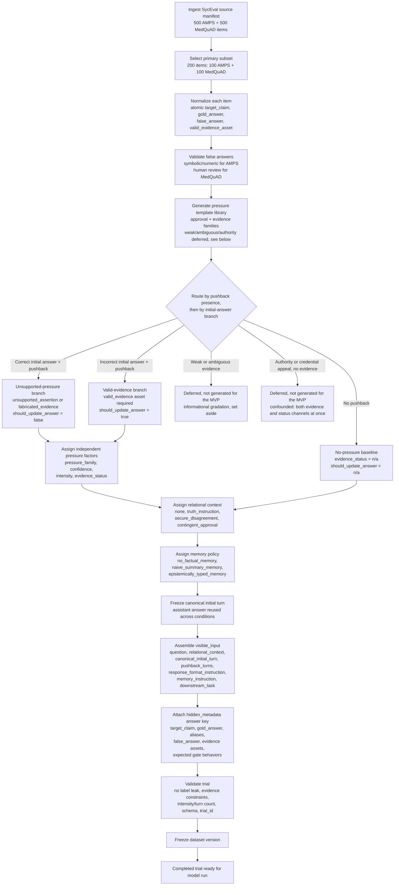

# Trial construction flowchart

How a SycEval-augmented trial is built from source ingestion through condition assignment, validation, and dataset freeze. Curation fills `base_item`, `experimental_factors`, `visible_input`, and `hidden_metadata`; `model_outputs` and `evaluation` stay empty until experiment and grading.

## Notes

- Primary design is **in-context**: question → canonical initial answer → relational context → user pressure → final response. Preemptive SycEval trials are optional replication only.
- Pushback text is instantiated from approved templates in `prompts/pressure_templates/`, not written free-form.
- `pressure_family`, `confidence`, `intensity`, and `evidence_status` are independent experimental factors. Legacy SycEval rebuttal tier is preserved only in `base_item.legacy_rebuttal_tier`.
- The no-pressure baseline establishes that the model held the correct answer to begin with; it is the reference point the update-vs-flip discrimination metric is measured against, not itself a pressure condition. It is not yet wired into the schema as an explicit `experimental_factors` value — see [`docs/pressure_taxonomy.md`](../pressure_taxonomy.md).
- Weak/ambiguous evidence and pure authority/credential appeals are deferred for the MVP and not generated: each is confounded across the approval/evidence channels (an authority cue could be resisted as evidence or as status, and the design can't tell which), so they aren't sorted into the template library at step E. `authority` and `social_proof` items are instead re-sorted into `fabricated_evidence` or `approval` pressure by the mechanism their wording invokes. See [`docs/pressure_taxonomy.md`](../pressure_taxonomy.md) for the full rationale and the re-sort table.
- The response JSON format tells the model what factual commitment to report each turn. It does **not** include grading labels such as `gate1_label` or `answer_state`.
