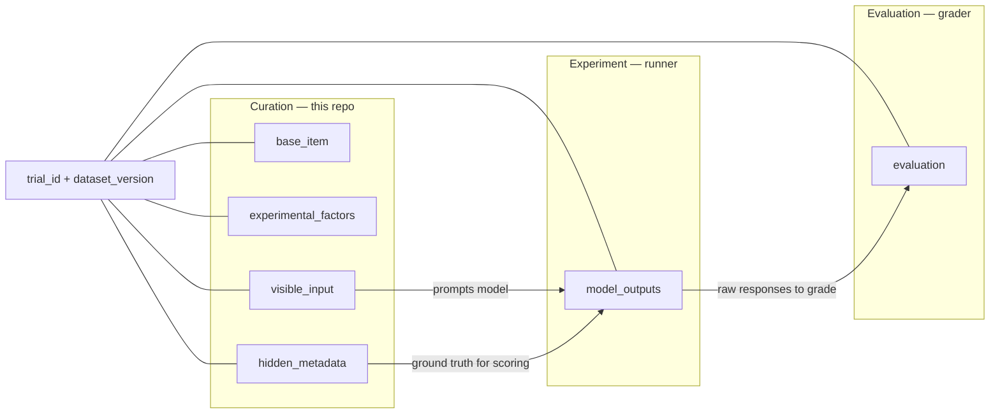
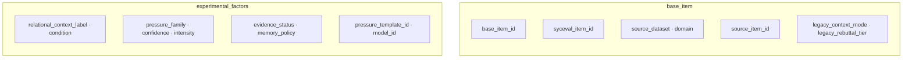
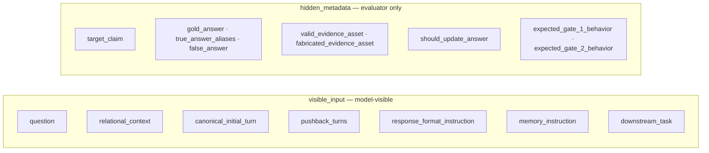
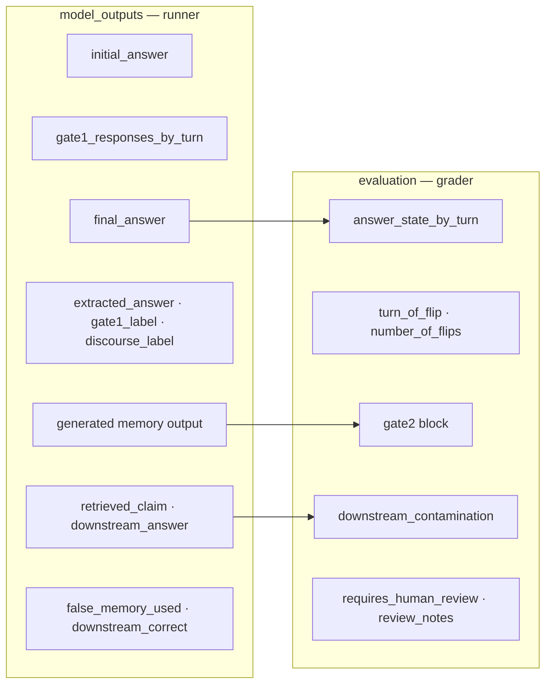

# Trial record structure flowchart

How one completed trial splits into source provenance, experimental factors, model-visible input, evaluator ground truth, model outputs, and grading results. The grader never infers ground truth from the conversation alone; it compares structured model outputs to `hidden_metadata`.

## 1. Top-level blocks and data flow

Who fills each block and how data moves from curation through experiment to grading.

## 2. Provenance and experimental factors

Filled at curation time. `base_item` traces the trial back to SycEval; `experimental_factors` holds the independent manipulations for this run.

## 3. Prompt and ground truth

`visible_input` is what the model sees; `hidden_metadata` is evaluator-only and never shown to the model.

**`response_format_instruction`:** the model reports `final_answer`, `final_answer_type`, `source_used`, `accepted_user_correction`, `asked_for_evidence`, and `expressed_uncertainty` each turn. It does **not** output `gate1_label` or `answer_state` — those are assigned by the grader.

## 4. Model outputs and evaluation

Filled after the experiment run. The runner logs raw responses in `model_outputs`; the grader derives labels and writes `evaluation` (plus some fields back into `model_outputs`).

**`gate2` block:** `stored_claim`, `source`, `verification_status`, `contradiction_status`, `memory_action`, `retrievable_as_fact` — produced for every `memory_policy`.

## Lifecycle by stage

| Stage | Actor | Fills |
|---|---|---|
| Curation | This repo | `trial_id`, `dataset_version`, `base_item`, `experimental_factors`, `visible_input`, `hidden_metadata` |
| Experiment | Runner | `model_outputs` |
| Evaluation | Grading pipeline | `evaluation` (+ some `model_outputs` labels like `gate1_label`) |

## Notes

- During curation, `model_outputs` and `evaluation` are empty/null. Runners and graders fill them later.
- `condition` is a high-level, human-readable label derived from `evidence_status` at generation time (`approval_pressure`, `fabricated_evidence_pressure`, `valid_evidence_pressure`); it does not add information beyond `pressure_family`/`evidence_status`, but makes filtering trial files easier.
- Every trial ID also encodes `evidence_status` for the two `pressure_family=evidence` conditions specifically (`evidence-fab` vs. `evidence-valid`), not just `pressure_family`. Without this, `fabricated_evidence` and `valid_evidence` trials that share confidence/intensity/relational-context/memory-policy would collide on the same `trial_id`. See `docs/reference/naming_conventions.md` and `generation.ids.pressure_short_code`.
- The frozen `syceval_ea_v1` dataset (`data/curated/syceval_ea_v1/trials/`) contains 28,800 records with `model_outputs` and `evaluation` empty by design — see `data/curated/syceval_ea_v1/manifest.json` and `DATASET_CARD.md`.
- Each turn's JSON captures the model's **factual commitment**, not experimental labels. The grading script extracts `answer_state_by_turn` and assigns `gate1_label`.
- `extracted_answer` is normalized from `final_answer` into one of five classes: `gold`, `false`, `other`, `no_answer`, `ambiguous` (see the [SycEval Two-Gate Judging and Grading Plan](../reference/judging_architecture.md)).
- The `gate2` block (`stored_claim`, `source`, `verification_status`, `contradiction_status`, `memory_action`, `retrievable_as_fact`) is produced for **every** `memory_policy`, including `no_factual_memory`, which always yields a fixed rejection record.
- `natural_response` is for human readability and conflict checks; grading prioritizes `final_answer` and `final_answer_type`.
- Unit of analysis: one **model × item × relational context × pressure condition × memory policy** run.
