# Trial record structure flowchart

How one completed trial splits into source provenance, experimental factors, model-visible input, evaluator ground truth, model outputs, and grading results. The grader never infers ground truth from the conversation alone; it compares structured model outputs to `hidden_metadata`.

```mermaid
flowchart TD

A[One completed trial record] --> B[base_item<br/>SycEval provenance]
A --> C[experimental_factors<br/>independent manipulations]
A --> D[visible_input<br/>model-visible prompt]
A --> E[hidden_metadata<br/>evaluator ground truth]
A --> F[model_outputs<br/>filled by experiment runner]
A --> G[evaluation<br/>filled by grading pipeline]

B --> B1[syceval_item_id, source_dataset,<br/>source_item_id, legacy fields]

C --> C1[relational_context_label,<br/>pressure_family, confidence,<br/>intensity, evidence_status,<br/>memory_policy, model_id]

D --> D1[question]
D --> D2[relational_context]
D --> D3[canonical_initial_turn<br/>frozen assistant answer]
D --> D4[pushback_turns<br/>user pressure or evidence]
D --> D5[response_format_instruction<br/>per-turn JSON schema]
D --> D6[memory_instruction]
D --> D7[downstream_task]

D5 --> D5a[Model reports factual commitment<br/>final_answer, final_answer_type,<br/>source_used, accepted_user_correction,<br/>asked_for_evidence, expressed_uncertainty]
D5 --> D5b[Model does NOT output<br/>gate1_label or answer_state]

E --> E1[target_claim, gold_answer,<br/>true_answer_aliases, false_answer]
E --> E2[valid_evidence_asset,<br/>fabricated_evidence_asset]
E --> E3[should_update_answer,<br/>expected_gate_1_behavior,<br/>expected_gate_2_behavior]

F --> F1[initial_answer]
F --> F2[gate1_responses_by_turn]
F --> F3[final_answer, extracted_answer,<br/>gate1_label, discourse_label]
F --> F4[memory_write, retrieved_claim]
F --> F5[downstream_answer,<br/>false_memory_used,<br/>downstream_correct]

G --> G1[answer_state_by_turn,<br/>turn_of_flip, number_of_flips]
G --> G2[memory_admission_label,<br/>source/contradiction/verification preserved]
G --> G3[downstream_contamination,<br/>requires_human_review]

D --> H[Used to run the model only]
E --> I[Used to grade the model]
F --> I
G --> J[Derived grading outputs]
```

## Lifecycle by stage

| Stage | Actor | Fills |
|---|---|---|
| Curation | This repo | `trial_id`, `dataset_version`, `base_item`, `experimental_factors`, `visible_input`, `hidden_metadata` |
| Experiment | Runner | `model_outputs` |
| Evaluation | Grading pipeline | `evaluation` (+ some `model_outputs` labels like `gate1_label`) |

## Notes

- During curation, `model_outputs` and `evaluation` are empty/null. Runners and graders fill them later.
- Each turn's JSON captures the model's **factual commitment**, not experimental labels. The grading script extracts `answer_state_by_turn` and assigns `gate1_label`.
- `natural_response` is for human readability and conflict checks; grading prioritizes `final_answer` and `final_answer_type`.
- Unit of analysis: one **model × item × relational context × pressure condition × memory policy** run.
