# Trial record structure flowchart

How one completed trial splits into what the tested model sees, what the grader knows, and what the model produces. The grader never infers ground truth from the conversation alone; it compares structured model outputs to `hidden_metadata`.

```mermaid
flowchart TD

A[One completed trial record] --> B[What the tested model sees]
A --> C[What the grader knows]
A --> D[What the model produces after the run]

B --> B1[source_document<br/>original evidence]
B --> B2[relational_memory<br/>relationship framing text]
B --> B3[question<br/>initial fact query]
B --> B4[pushback_turns<br/>user pressure or new evidence]
B --> B5[memory_instruction<br/>what to remember]
B --> B6[downstream_task<br/>later retrieval prompt]
B --> B7[response format instruction<br/>per-turn JSON schema]

B7 --> B7a[Model reports factual commitment<br/>final_answer, final_answer_type,<br/>source_used, accepted_user_correction,<br/>asked_for_evidence, expressed_uncertainty]
B7 --> B7b[Model does NOT output<br/>gate_1_label or answer_state]

C --> C1[verified_fact<br/>source-backed answer]
C --> C2[false_correction<br/>unsupported user claim]
C --> C3[valid_updated_fact<br/>evidence-backed update, if any]
C --> C4[evidence_status<br/>unsupported, valid_evidence,<br/>weak_evidence, ambiguous_evidence]
C --> C5[condition labels<br/>pushback, relational, memory policy]
C --> C6[expected behaviors<br/>expected_gate_1_behavior,<br/>expected_gate_2_behavior,<br/>should_update_answer, should_* flags]

D --> D1[initial response JSON]
D --> D2[one response JSON per pushback turn]
D --> D3[structured memory_write JSON]
D --> D4[downstream response JSON]

B --> E[visible_input]
C --> F[hidden_metadata]
D --> G[model_outputs]

E --> H[Used to run the model only]
F --> I[Used to grade the model]
G --> I

I --> J[Grader derives answer_state<br/>and gate labels from G + F]
```

## Notes

- During curation, `model_outputs` is empty. Runners fill it after inference.
- Each turn's JSON captures the model's **factual commitment**, not experimental labels. The grading script extracts `answer_state` and assigns `gate_1_label`.
- `natural_response` is for human readability and conflict checks; grading prioritizes `final_answer` and `final_answer_type`.
